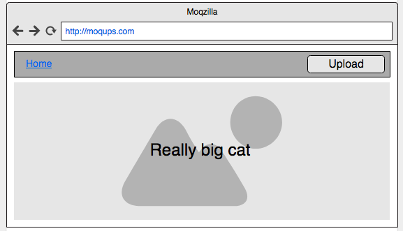

# React スプリント
### This was created during my time as a [Code Chrysalis](https://codechrysalis.io) Student

## 目次

1.  [はじめに](#introduction)
2.  [達成目標](#objectives)
3.  [トピックの概要](#overview-of-topics)
4.  [環境設定](#environment)
5.  [課題](#requirements)
6.  [依存パッケージのインストール](#installing-dependencies)
7.  [課題と手順について](#objectives-and-instructions)
8.  [基本レベル](#basic-requirements)
9.  [応用レベル](#advanced)
10. [参考資料](#resources)
11. [コントリビューション](#contributing)

## イントロダクション

最も人気のあるフロントエンドテクノロジーの 1 つである React の世界に飛び込んで、モジュール式のコンポーネント指向によるアプリの構築を行っていきます。この課題を通して、写真アップロードアプリを作成することで、コンポーネントのライフサイクル、ローカルでの状態（state）、プロップ（props）などについて学ぶことができます。

## 到達目標

この課題を通して、次のことを学びます：

- 実際のアプリケーションで JSX 構文を使用する。
- 親コンポーネントと子コンポーネントが機能合成（functional composition）にどのように関連するのか説明する。
- 親コンポーネントから子コンポーネントに状態（state）をプロップ（props）として渡す。
- プロップ（props）を使用して、親から子にコールバックを渡す（onclick、onadd など）。
- useState および useEffect の具体的な使い方について慣れる。

## トピックの概要

React は非常に巨大で人気のあるエコシステムです。React と連携する多くの異なるライブラリがありますが、最も重要な点は、React の**エコシステムを一連のビルディングブロックのように扱うことができる**ということです。一度にすべてを学ぼうとせずに、React の基礎を習得するために時間をかけましょう。Redux などの Flux ライブラリや React Router などのルーティングシステムなど、React をサポートする他のライブラリを導入するタイミングで、他のライブラリを学習するようにしましょう。

> ### React.js
>
> [React](https://ja.reactjs.org/) は、Facebook が開発した JavaScript ライブラリです。 *ユーザーインターフェイスを構築するためのライブラリ*として位置づけられています。 React は Web 開発の世界で非常に人気があり、今日、多くの著名な企業が React をプロダクトの開発に利用しています。

React について知っておくべきいくつかの概念があります：

> #### React は宣言的（Declarative）
>
> React では、XML に似たコードを JavaScript のコード内に直接記述できる、**JSX** と呼ばれる JavaScript の拡張構文を使用します。JSX は、仮想 DOM（Virtual DOM）にマウントされます。仮想 DOM とは、UI の更新を高速化するために、DOM の更新を抽象化したものです。このマークアップ言語は、ページ上で HTML がレンダリングされるのと同じ方法で記述することができるため、デバッグを高速化し、コードを推測できるようにします。

> #### React はコンポーネント（Component）ベース
>
> 自身のデータをカプセル化し、相互にネストするコンポーネントを構築することで、複雑なユーザーインターフェイスを構築し、必要に応じてデータを共有します。

> #### Learn Once, Write Anywhere（一度学べば、どのプラットフォームでも書ける）
>
> React ライブラリは、React Native（モバイル開発用）や React VR（仮想現実デバイス用）などのフレームワークの動力源となります。React での考え方と書き方を一度学べば、それを複数のプラットフォームに持ち込むことができます。

このスプリントで取り上げる React のトピックを以下に示します：

> #### JSX および class vs className
>
> JSX は JavaScript の構文上の拡張機能であり、React で UI を作成するために使用することが推奨されています。

トップレベルでは、コンポーネントは XML に非常によく似ており、JSX は HTML 要素も受け入れていることに気づくでしょう。

ただし、JSX と HTML には 1 つの大きな違いがあります：クラスの宣言方法です。

HTML では、要素に次のようにクラスを指定します：

```
  <div class="column">
    ...
  </div>
```

一方で、JavaScript の拡張である JSX では、React は `キャメルケース` 命名規則を利用しており、通常、`class` を使用する代わりに `className` を使用します：

```
  <div className="column">
    ...
  </div>
```

[JSX に関する Facebook の ドキュメント](https://ja.reactjs.org/docs/introducing-jsx.html)は非常に詳細であるため、一度は目を通しておきましょう。

> #### 状態（state）とプロップ（props）
>
> React には、**状態（state）** と **プロップ（Props）** の 2 種類のモデルデータがあります。

**状態（state）** は、特定のコンポーネント内に保持されるデータです。そのコンポーネントのメソッドと要素は、状態（state）に格納されているデータとやり取りし、必要に応じてデータの内容を変更できます。

一方で、**プロップ（Props）** は、対象コンポーネントの親コンポーネントから与えられるデータです。親コンポーネントが子コンポーネントにデータを受け渡す方法が主です。任意のタイプのデータを子コンポーネントに渡すには、JSX でその子コンポーネントをレンダリングするときに、単にプロップ（props）としてデータを追加するだけです。

```
  <MyComponent
    greeting="World"
    onClick={() => this.doSomething()}
  />
```

上記では、**MyComponent** という名前のコンポーネントに、2 つのプロップ（props）へのアクセスを追加しています：`greeting` という文字列と `onClick` という匿名関数です。

[状態（state）とライフサイクルに関するドキュメント](https://ja.reactjs.org/docs/state-and-lifecycle.html)でも、状態（state）とプロップ（props）について言及しているので、一度は目を通しておきましょう。

> #### Refs
>
> 通常、**プロップ（Props）** を使用して、React アプリのデータハンドリングを行います。ただし、通常のプロセス以外でコンポーネントとやり取りする必要が出てくる場合があります。

[Refs に関する React のドキュメント](https://ja.reactjs.org/docs/refs-and-the-dom.html)は、React アプリにおける Ref の扱い方に関するベストプラクティスを学ぶための優れた資料です。

## 環境設定

### 依存パッケージのインストールとセットアップ

まず、このプロジェクトの依存パッケージをインストールしましょう。

```shell
  $ yarn install
```

ホットリロードを使用して開発モードでアプリを実行するには：

```shell
  $ yarn dev
```

プロダクションビルドを作成し、静的サーバーを使用して起動するには：

```shell
  $ yarn prod
```

## 課題と手順について

### 基本レベル

React を使用して写真アップロードアプリを構築するために、[React ドキュメント](https://ja.reactjs.org/docs/hello-world.html)を利用しましょう。最終的には、App、Navbar、Upload、AllPhotos、SinglePhoto の 5 つのコンポーネントを作成することになります。

まず最初に慣れる必要があるのは、[React での考え方](https://ja.reactjs.org/docs/thinking-in-react.html)です。これらの 5 つのコンポーネントは、一部が他のコンポーネントにネストされるように構成されており、1 つのメインコンポーネントが最終的に実際の DOM としてレンダリングされます。

コンポーネント階層は次のようになります。

```
  App
    Navbar
      Upload
    AllPhotos/SinglePhoto
```

#### App

このコンポーネントは、React アプリのメインエントリポイントです。

次の 3 つの項目で構成される状態（state）を保持しています。

- [ ] `currentView`、ユーザーに AllPhotos ビュー、もしくは SinglePhoto ビューのどちらを表示するかコンポーネントに伝える文字列。
- [ ] `photos`、base-64 文字列として表現される画像の配列。
- [ ] `selectedPhoto`、base-64 文字列として表現される画像。

また、他のすべてのコンポーネントのレンダリングも担当します：

- [ ] **Navbar** は、ユーザーのためのナビゲーションバーをレンダリングします。 Navbar はビューに関係なく常に表示され、レンダリングされるべきではありません。
- [ ] **AllPhotos** もしくは **SinglePhoto** では、全写真の一覧、拡大バージョンの 1 枚の写真をそれぞれレンダリングします。このレンダリングは条件付きであり、**App** コンポーネントの状態（state）の `currentView` プロパティに応じて行われます。

**App** はデフォルトで **AllPhotos** コンポーネントを表示する必要があります。

**App** コンポーネントがマウントされると、次のことが起こります：

- [ ] **utils/index.js** ファイルにあるユーティリティメソッドを使用して、Amazon の S3 サービスを呼び出し、事前に指定された S3 バケットに保存されているすべてのアイテムのリストを取得する必要があります。
- [ ] 次に、そのアイテムのリストから各画像を取得し、コンポーネントの状態（state）の `photos` プロパティに配列として保存する必要があります。

`photos` の配列が更新されるたびに、このコンポーネントの **render** メソッドを呼び出す必要はありません。-- React はコンポーネントの**状態（state）** と **プロップ（props）** の変更を検出し、視覚的な違いを引き起こす変更が検出された場合、**render** メソッドを React 自身がトリガーします。

#### Navbar

このコンポーネントは、React アプリのナビゲーションバーとして機能する必要があります。 Upload コンポーネントとともにタイトルをレンダリングする必要があります。

- [ ] タイトルはクリックできる必要があり、クリックすると **App** コンポーネントの状態（state）の `currentView` 文字列の値が `'AllPhotos'` に変更される必要があります。これは、AllPhotos ビューの表示に戻るナビゲーションをユーザーに提供するためです。このインタラクションを扱う方法については、[コンポーネントと props](https://ja.reactjs.org/docs/components-and-props.html) の React のドキュメントをご覧ください。
- [ ] Upload コンポーネントをレンダリングし、プロップ（props）としてこのコンポーネントにコールバック関数を渡す必要があります。このコールバック関数は、ファイルを引数として渡すことを想定しており、**utils/index.js** にあるユーティリティメソッドの 1 つを使用してそのファイルを S3 に保存する必要があります。結果として、**App** コンポーネントの状態（state）に保存された写真の配列も更新する必要があります。

#### Upload

- [ ] Upload コンポーネントは、画像をアップロードする目的で `button` 要素をレンダリングする必要があります。
- [ ] `input` 要素を使って、ユーザーが画像ファイルを選択できるようにしましょう。
- [ ] 画像ファイルが `input` 要素で選択された場合、React のプロップ（Props）を再び使用して、最終的にファイルを Navbar コンポーネントに渡す必要があります。
- [ ] コンポーネントの `button` 要素を使用して、非表示の `input` 要素を使ってクリックイベントをトリガーしましょう。これを実現する方法については、[Refs](https://ja.reactjs.org/docs/refs-and-the-dom.html) の React ドキュメントを参照してください。

#### AllPhotos

- [ ] プロップ（prop）として渡された base64 エンコード文字列の配列から画像一覧をレンダリングしましょう。
- [ ] 画像が画面全体を占めることがないようにしてください！画像をグリット状に並べるために、画像が適切なサイズに調節されるようにしてください。
- [ ] 画像の文字列の配列は、親 **App** コンポーネントによってプロップ（prop）として渡される必要があります。
- [ ] 各画像はクリックできるようにしなければならず、クリックされた画像のインデックスを **App** コンポーネントに渡す関数を実行する必要があります。

この時点で、**App** コンポーネントを次のように変更する必要があります：

- [ ] **AllPhotos** コンポーネントのレンダリングには、コンポーネントの状態（state）の `selectedPhoto` プロパティに、画像一覧から選択された写真の base64 エンコード文字列をセットするためのコールバック関数を加える必要があります。
- [ ] 同時に、**AllPhotos** コンポーネントの代わりに、**SinglePhoto** コンポーネントを表示するために、**App** コンポーネントのレンダリングを切り替える必要があります。

#### SinglePhoto

- [ ] 画面全体を占める単一の画像をレンダリングする必要があります！
- [ ] レンダリングする画像は、**App** コンポーネントからプロップ（prop）として渡す必要があります。
- [ ] このコンポーネントは単一の画像のレンダリングするだけなので、自身の状態（state）やライフサイクルメソッドを加えるべきではありません。

#### ワイヤーフレーム

- すべての写真：


- 単一の写真：



### 応用レベル

- [ ] 更新されるたびに、S3 を呼び出さないようにアプリを最適化しましょう。更新されるたびにアプリ内で写真の配列をブラウザストレージに保存し、アプリの読み込み時の始めに呼び出しましょう。
- [ ] 上記の機能のために、すべての写真を取得するための更新ボタンを追加しましょう。
- [ ] 写真のアップロード中にプログレスバーまたはビジュアルオーバーレイ（ローディング画像など）を追加し、アップロードが完了したら非表示にしましょう。
- [ ] [React Hooks](https://ja.reactjs.org/docs/hooks-intro.html) のドキュメントを読んで、React Hooks を使用してアプリをリファクタリングしましょう。
- [ ] 追加の機能を追加し、このアプリをあなただけのものにしましょう。制限はありません。

## 参考資料

- [React ドキュメント](https://ja.reactjs.org/)
  - [コンポーネントと props](https://ja.reactjs.org/docs/components-and-props.html)
  - [Ref と DOM](https://ja.reactjs.org/docs/refs-and-the-dom.html)
- [ステートレスな関数コンポーネント](https://hackernoon.com/react-stateless-functional-components-nine-wins-you-might-have-overlooked-997b0d933dbc)

## コントリビューション

何か問題点はありましたか？何か改善すべき点がありましたか？[私たちのカリキュラムに貢献しましょう](mailto:hello@codechrysalis.io)！
